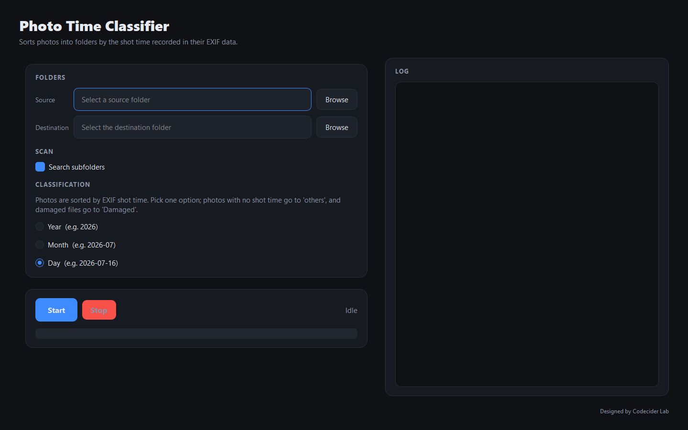

# Photo Time Classifier

A desktop application that automatically sorts photos into folders by the **shot time recorded in their EXIF data**.
The classification logic is fully decoupled from the GUI, so it can be reused unchanged across CLI, batch jobs, server APIs, tests, and more.



## Download

Pre-built Windows executables (GUI and CLI) are attached to each
[GitHub Release](../../releases). No Python installation is required — download,
unzip, and run `PhotoTimeClassifier.exe`.

To run from source instead, see [Installation](#installation).

## Features

- **Sort by EXIF shot time**: photos are filed by when the shutter actually fired, not by file timestamps.
- **One granularity per run**: choose **Year**, **Month**, or **Day** — the options are mutually exclusive.
- **No shot time? No problem**: photos without EXIF shot time are copied to `others` instead of being dropped.
- **HEIC/HEIF support**: reads iPhone photos via `pi-heif`.
- **Layered architecture**: GUI (input/display), filters (image inspection), and services (files, EXIF) are independent packages.
- **Asynchronous processing**: classification runs on a separate thread, so the UI never freezes.
- **Cancellable jobs**: processing can be stopped safely at any time.
- **Damaged-image handling**: damaged files — whether partially damaged or fully corrupt — are set aside in `Damaged`.
- **Collision-safe copies**: same-named photos become `name_1.jpg`, `name_2.jpg`, and so on.
- **Modern dark-theme UI** (optimized for Full HD).

## Classification Folder Rules

Exactly one option is active per run, and the destination folder is named after the shot time.

| Option | Folder created | Example |
|:--:|--|--|
| **Year** | `YYYY` | `2026/` |
| **Month** | `YYYY-MM` | `2026-07/` |
| **Day** | `YYYY-MM-DD` | `2026-07-16/` |

```text
destination/
├── 2026-07-16/        # photos shot on that day
├── 2025-12-24/
├── others/            # no EXIF shot time
└── Damaged/           # partially damaged or fully corrupt files
```

- **Photos with no EXIF shot time are copied to `others`.**
- **Damaged photos are separated into `Damaged`.** This covers both partially damaged files (they open, but the pixel data is truncated) and files too corrupt to open at all. A damaged photo goes to `Damaged` even if it carries a shot time.
- The shot time is read from `DateTimeOriginal`, falling back to `DateTimeDigitized` and then `DateTime`.
- Photos land **directly inside** their date folder; the source subfolder layout is not recreated underneath it.
- Original files are **copied, never moved** — the source folder is left untouched.

## Project Structure

```text
photoTimeClassifier/
├── main.py                     # GUI entry point
├── cli.py                      # Command-line entry point
├── core/                       # GUI-independent orchestration
│   └── pipeline.py             # Shared scan → read EXIF → copy pipeline
├── gui/                        # PyQt5 UI layer (no classification logic)
│   ├── main_window.py          # Folder selection, options, progress, log, start/stop
│   ├── classify_worker.py      # QThread wrapper around core.pipeline
│   └── theme.py                # Dark-theme color palette + QSS
├── filters/                    # Image inspection layer (no GUI dependency)
│   └── image_integrity.py      # Image integrity checks (corrupt/partial damage)
├── services/                   # File-handling layer
│   ├── image_scanner.py        # Collect images by extension / subfolder
│   ├── exif_reader.py          # Read the EXIF shot time
│   ├── categorizer.py          # Map shot time + granularity → folder name
│   └── file_copy_service.py    # Dedup-safe copy into the destination folder
├── assets/                     # App icon
├── tests/                      # pytest unit tests
├── requirements.txt            # Runtime dependencies
├── requirements-dev.txt        # + tests and build tooling (PDF manual, .exe)
├── run.bat                     # Launch the GUI
├── cli.bat                     # Launch the CLI
└── test.bat                    # Run the tests
```

## Layer Responsibilities

| Layer | Responsible for | Does not do |
|-------|-----------------|-------------|
| `gui` | Folder selection, option input, progress/log display, start/stop | Reading EXIF, naming folders |
| `core` | Orchestrating scan → inspect → read EXIF → copy | GUI signals, widget state |
| `services` | Image collection, EXIF reading, folder naming, deduplicated copy | GUI, image decoding policy |
| `filters` | Deciding whether an image is intact, damaged, or corrupt | File copying, GUI signals |

## Installation

```bash
pip install -r requirements.txt
```

To run the tests, rebuild the PDF manual, or build the standalone `.exe`, install
the development tooling too:

```bash
pip install -r requirements-dev.txt   # includes requirements.txt

python -m pytest                      # run the unit tests (pytest)
python build_manual.py                # regenerate USER_MANUAL.pdf (reportlab)
python build_exe.py                   # build dist/ executables (pyinstaller)
```

## Usage

```bash
python main.py
```

1. Select the **source folder** and the **output folder**.
2. Pick one classification option: **Year**, **Month**, or **Day**.
3. Click **Start**; photos are copied into folders named after their shot time.

## Command-Line Interface (CLI)

The same pipeline is available without the GUI:

```bash
python cli.py SOURCE DESTINATION [options]

# Examples
python cli.py ./photos ./sorted            # sort by day (default)
python cli.py ./photos ./sorted --year     # sort into 2026/
python cli.py ./photos ./sorted --month    # sort into 2026-07/
python cli.py ./photos ./sorted --day --no-recursive --quiet
```

On Windows you can also use `cli.bat SOURCE DESTINATION [options]`.

| Option | Description | Default |
|--------|-------------|---------|
| `--year` | Sort into year folders (`2026`) | off |
| `--month` | Sort into year-month folders (`2026-07`) | off |
| `--day` | Sort into year-month-day folders (`2026-07-16`) | **on** |
| `--no-recursive` | Do not scan subfolders | off |
| `-q`, `--quiet` | Show a progress bar instead of per-image lines | off |

`--year`, `--month`, and `--day` are mutually exclusive.

Press `Ctrl+C` to stop gracefully; a summary is still printed. The exit code is `0` on success and `1` on a fatal error.

## Using the Services Standalone

The EXIF reader and folder naming can be reused without the GUI.

```python
from services import DAY, MONTH, build_subfolder, read_shot_time

shot_time = read_shot_time("photo.jpg")   # datetime or None

print(build_subfolder(DAY, shot_time))    # '2026-07-16', or 'others' if None
print(build_subfolder(MONTH, shot_time))  # '2026-07'
```

Running the whole pipeline programmatically:

```python
from core import ClassifyConfig, run_classification

summary = run_classification(
    ClassifyConfig(
        source_folder="./photos",
        destination_folder="./sorted",
        granularity="month",
        recursive=True,
    ),
    on_log=print,
)
print(summary.total, summary.with_time, summary.others, summary.copied)
```

## Error Handling

| Situation | Behavior |
|-----------|----------|
| Bad source folder, unknown option | `PipelineError` — aborts the whole run |
| Fully corrupt image | Copied to `Damaged` and counted, run continues |
| Partially damaged image | Copied to `Damaged` and counted, run continues |
| Unreadable/absent EXIF | Copied to `others`, run continues |
| Copy failure (OS error) | Logged and counted as failed, run continues |

## Supported Formats

`.jpg`, `.jpeg`, `.png`, `.bmp`, `.webp`, `.tif`, `.tiff`, `.heic`, `.heif`

EXIF shot time is most commonly present in JPEG, HEIC, and TIFF files. Formats
that carry no EXIF (typically PNG and BMP) are sorted into `others`.

## Tests

```bash
pip install -r requirements-dev.txt   # pytest lives here, not in requirements.txt
python -m pytest
```

## License

Copyright (C) 2026 Codecider Lab

Released under the **GNU Affero General Public License v3.0 (AGPL-3.0)** — see
[LICENSE](LICENSE). The GUI depends on [PyQt5](https://pypi.org/project/PyQt5/)
(GPL-3.0), which is compatible with AGPL-3.0.

See [THIRD_PARTY_NOTICES.md](THIRD_PARTY_NOTICES.md) for all dependency
licenses.
